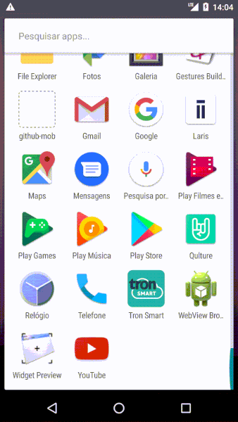

# :metal: qulture-challenge
Repository made to show my knowledge of react native, based on the challenge proposed by Qulture.Rocks.

# :iphone: Mobile preview

# :fire: Used technologies
- React Native + Hooks
- Redux + Hooks
- Redux Thunk
- Styled Components
- Formik
- Reactotron
- React Navigation
- Jest + Enzime
- Prettier
- Eslint

# :wrench: Running mobile locally
- You must have the react-native enviroment seted up in your machine.
- Enter the directory.
- Run `yarn` or `npm install`.
- Than run `react-native run-android or run-ios`.

_OBS:_ For ios you need to enter the ios folder and run the `pod install` command.

# :exclamation: Possible improvements
- Delete a collaborator.
- API pagination.
- Collaborator filter.
- Timeline + Dashboard.

# :man: Contributors
- @GleidsonDaniel
